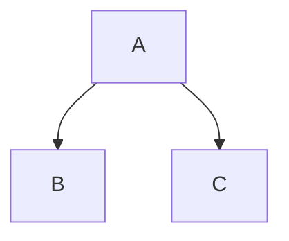

# MkImp

<p align="center">
    
    
    
</p>

**MkImp** vous permet d’écrire du Markdown comme un(e) vrai(e) développeur(se) — avec puissance, précision et extensibilité.

⚠️ **Remarque :** MkImp **ne suit pas** strictement la spécification Markdown classique. Il définit ses propres règles et **ne prend pas en charge les extensions personnalisées** par défaut.

Si vous souhaitez proposer une fonctionnalité, ouvrez une issue ou une pull request. Si elle est refusée, vous êtes libre de forker le projet pour l’adapter à vos besoins.

MkImp utilise :
- [`highlight.js`](https://highlightjs.org/) pour la coloration syntaxique
- [`KaTeX`](https://katex.org/) pour les formules mathématiques (vous pouvez utiliser un autre générateur de rendu LaTeX)
- Et est **compatible** avec [`Mermaid`](https://mermaid.js.org/) pour les diagrammes (vous devez gérer le rendu)

---

## 🚀 Installation

Installez MkImp via npm :

```bash
npm install mkimp
```

---

## 🔧 Utilisation

```ts
import { MkImp } from "mkimp";

const mkimp = new MkImp({
  async include(loc, from, to) {
    return `${loc} de [${from}] à [${to}]`;
  },
  async includeCode(loc, from, to) {
    return `${loc} de [${from}] à [${to}]`;
  },
});

console.log(await mkimp.parse("# Bonjour\n\nCeci *est* un __beau__ markdown !"));
```

---

## ⚙️ Options disponibles

```ts
interface MkImpOptions {
  tabulation?: number; // Nombre d'espaces pour une indentation (par défaut : 4)
  metadata?: Map<string, string>; // Métadonnées à injecter (non écrasées si déjà présentes)
  emojis?: Record<string, EmojiRecord>; // Emojis personnalisés
  frontMatter?: (content: string) => Promise<unknown>; // Parseur front matter personnalisé (par défaut : JSON)
  include?: (location: string, from?: number, to?: number) => Promise<string | undefined>; // Gestion des blocs !INCLUDE
  includeCode?: (location: string, from?: number, to?: number) => Promise<string | undefined>; // Gestion des blocs !INCLUDECODE
  latex?: (token: TexToken) => Promise<string> // LaTeX code handler (default: KaTeX)
  withSection?: boolean; // Grouper les titres par section (par défaut : false)
  renderTarget?: RenderTarget; // Format de rendu ("raw" ou "article")
}

type RenderTarget = "raw" | "article";

type EmojiRecord =
  | { type: "char"; char: string }
  | { type: "img"; url: string; alt?: string; width?: number; height?: number }
  | { type: "i"; className: string };
```

---

## 🧱 API

```ts
class MkImp {
  constructor(options?: MkImpOptions);

  ast(markdown: string): Promise<RootToken>;  // Génère l’AST
  render(root: RootToken): Promise<string>;   // Rend en HTML à partir de l’AST
  parse(markdown: string): Promise<string>;   // Parse directement le markdown vers du HTML
}
```

---

## 📚 Syntaxe supportée

MkImp n’est **pas du Markdown classique**. Voici toutes les fonctionnalités disponibles :

### 🧩 Syntaxe de bloc

#### Titres

```md
# Titre 1
## Titre 2
...

Titres style Setext :
Titre 1
===

Titre 2
---
```

ID personnalisé :  
```md
# Mon titre {#mon-id}
```

Activer la numérotation automatique :
```md
#! Titre avec index
```

#### Table des matières

```md
!TableOfContent
```

#### Blocs de code

##### Indenté :
```
    let x = 42;
```

##### Fermé :
````
```cpp
const x = 42;
```
````
#### Citation

```md
> Ceci est une citation.
```

#### Spoiler

```md
!> Spoiler visible
Contenu masqué ici...
<!
```

#### Mathématiques (KaTeX)

```latex
$$
a^2 + b^2 = c^2
$$
```

#### Notes de bas de page

```md
[^note]: Ceci est une note.

Utilisée comme ceci[^note].
```

#### Liens de référence

```md
[ref]: https://exemple.com "Titre facultatif"
```

#### Listes et tâches

```md
1. Premier
2. Deuxième
   - Sous-élément
   - Élément

- [x] Tâche faite
- [ ] À faire
```

#### Listes de définition

```md
Terme
: Définition
: Autre définition
```

#### Règle horizontale

```md
----------------
```

#### Tableaux

```md
| Clé   | Valeur     |
|-------|------------|
| Un    | Première   |
```

#### HTML brut

```md
<div>

**Markdown à l’intérieur du HTML**

</div>
```

#### Inclusion de fichiers

```md
!INCLUDE "./fichier.md"
!INCLUDE "./fichier.md", l 1:5 s 1
```

#### Inclusion de code

```md
!INCLUDECODE "./fichier.ts" (ts), 5:10
```

#### Mermaid

````md

````

Le rendu Mermaid est à votre charge.

---

### ✨ Syntaxe en ligne

| Syntaxe | Description |
|---------|-------------|
| `\n` | Devient `<br/>` |
| `{{var}}` | Injecte une métadonnée |
| `` `code` `` | Code en ligne |
| `` | Image |
| `!YOUTUBE[Titre]{vid="..."}` | Vidéo YouTube intégrée |
| `[texte](/url "titre")` | Lien |
| `[^note]` | Référence de note |
| `[texte][ref]` | Lien de référence |
| `$x^2$` | Formule LaTeX en ligne |
| `$$x^2$$` | Formule en mode affiché |
| `<tag>` | HTML en ligne |
| `\|\|spoiler\|\|` / `>!spoiler!<` | Spoiler inline |
| `:smile:` | Emoji |
| `==texte==` | Surlignage |
| `~~texte~~` | Barré |
| `^^texte^^` | Ligne au-dessus |
| `__texte__` | Souligné |
| `*italique*` / `_italique_` | Italique |
| `**gras**` | Gras |
| `***gras italique***` | Gras + italique |
| `___italique souligné___` | Souligné + italique |

---

## 📦 Licence

[MIT](./LICENSE)

## 📖 Read me

For English speakers:

[Read me](./README.md)
