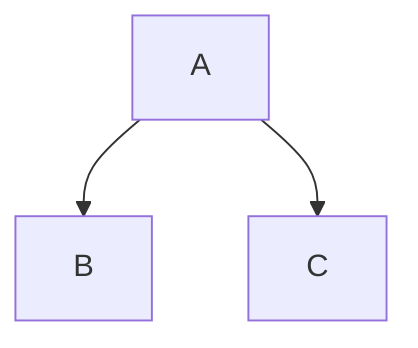

# MkImp

<p align="center">
    
    
    
</p>

**MkImp** lets you write Markdown like a programmer should be able to — with power, precision, and extensibility.

⚠️ **Note:** This is **not** standard Markdown. MkImp defines its own rules and does **not** support arbitrary extensions out of the box.

If you'd like to propose new features, please open an issue or a pull request. If a feature is declined, feel free to fork the project and build on it.

MkImp uses:
- [`highlight.js`](https://highlightjs.org/) for syntax highlighting
- [`KaTeX`](https://katex.org/) for mathematical formulas (you can use another LaTeX renderer)
- Optionally supports [`Mermaid`](https://mermaid.js.org/) for diagrams (you must handle rendering yourself)

---

## 🚀 Installation

Install using npm:

```bash
npm install mkimp
```

---

## 🔧 Usage

```ts
import { MkImp } from "mkimp";

const mkimp = new MkImp({
  async include(loc, from, to) {
    return `${loc} from [${from}] to [${to}]`;
  },
  async includeCode(loc, from, to) {
    return `${loc} from [${from}] to [${to}]`;
  },
});

console.log(await mkimp.parse("# Hello\n\nThis *is* some __nice__ markdown!"));
```

---

## ⚙️ Options

```ts
interface MkImpOptions {
  tabulation?: number; // Number of spaces per indentation level (default: 4)
  metadata?: Map<string, string>; // Front matter metadata (won't override existing entries)
  emojis?: Record<string, EmojiRecord>; // Custom emoji definitions
  frontMatter?: (content: string) => Promise<unknown>; // Custom front matter parser (default: JSON)
  include?: (location: string, from?: number, to?: number) => Promise<string | undefined>; // INCLUDE block handler
  includeCode?: (location: string, from?: number, to?: number) => Promise<string | undefined>; // INCLUDECODE block handler
  latex?: (token: TexToken) => Promise<string> // LaTeX code handler (default: KaTeX)
  withSection?: boolean; // Enable section-based rendering (default: false)
  renderTarget?: RenderTarget; // Output format (default: "raw")
}

type RenderTarget = "raw" | "article";

type EmojiRecord =
  | { type: "char"; char: string }
  | { type: "img"; url: string; alt?: string; width?: number; height?: number }
  | { type: "i"; className: string };
```

---

## 🧱 API

```ts
class MkImp {
  constructor(options?: MkImpOptions);

  ast(markdown: string): Promise<RootToken>;  // Generate AST
  render(root: RootToken): Promise<string>;   // Render HTML from AST
  parse(markdown: string): Promise<string>;   // Directly parse markdown to HTML
}
```

---

## 📚 Syntax Guide

MkImp is **not standard Markdown**, so here's a complete overview of supported syntax.

### 🧩 Block Syntax

#### Headings

```md
# Heading 1
## Heading 2
...

Setext-style headings:
Heading 1
===

Heading 2
---
```

Add an ID:  
```md
# My heading {#custom-id}
```

Enable automatic section numbering:
```md
#! Section Heading
```

#### Table of Contents

```md
!TableOfContent
```

#### Code Blocks

##### Indented code:

```
    let x = 42;
```

##### Fenced code:

````
```cpp
const x = 42;
```
````

#### Blockquote

```md
> This is a quote.
```

#### Spoilers

```md
!> Spoiler title
Spoiler content...
<!  // end of spoiler block
```

#### Math (KaTeX)

```latex
$$
a^2 + b^2 = c^2
$$
```

#### Footnotes

```md
[^note]: This is a footnote.

Referenced like so[^note].
```

#### Reference Links

```md
[ref]: https://example.com "Optional title"
```

#### Lists & Task Lists

```md
1. First
2. Second
   - Sublist
   - Item

- [x] Task done
- [ ] Task pending
```

#### Definition Lists

```md
Term
: Definition 1
: Definition 2
```

#### Horizontal Rules

```md
----------------
```

#### Tables

```md
| Key   | Value     |
|-------|-----------|
| One   | First row |
```

#### Raw HTML

You can mix HTML with markdown:

```md
<div>

**Markdown inside HTML block**

</div>
```

#### Includes

```md
!INCLUDE "./file.md"
!INCLUDE "./file.md", l 1:5 s 1  // lines 1–5, shift heading by 1
```

#### Include Code

```md
!INCLUDECODE "./file.ts" (ts), 5:10
```

#### Mermaid Diagrams

````md

````

Rendering Mermaid is **up to you** — MkImp only passes it through.

---

### ✨ Inline Syntax

| Syntax | Description |
|--------|-------------|
| `\n` | Turns into `<br/>` |
| `{{var}}` | Inject metadata |
| `` `code` `` | Inline code |
| `` | Image |
| `!YOUTUBE[title]{vid="..."}` | Embed YouTube |
| `[label](/url "title")` | Link |
| `[^foot]` | Footnote reference |
| `[text][ref]` | Reference link |
| `$x^2$` | Inline LaTeX |
| `$$x^2$$` | Display LaTeX |
| `<tag>` | Inline HTML |
| `\|\|spoiler\|\|` / `>!spoiler!<` | Inline spoiler |
| `:smile:` | Emoji |
| `==highlight==` | Highlight text |
| `~~strikethrough~~` | Strikethrough |
| `^^overline^^` | Overline |
| `__underline__` | Underline |
| `*italic*` / `_italic_` | Italic |
| `**bold**` | Bold |
| `***bold italic***` | Bold + Italic |
| `___underline italic___` | Underlined italic |
| `//comment` | Single line comment (end at the end of the line) |
| `/*comment*/` | Comment |

---

## 📦 License

[MIT](./LICENSE)

## 📖 Lisez Moi

Pour les francophones :

[Lisez moi](./LISEZMOI.md)
