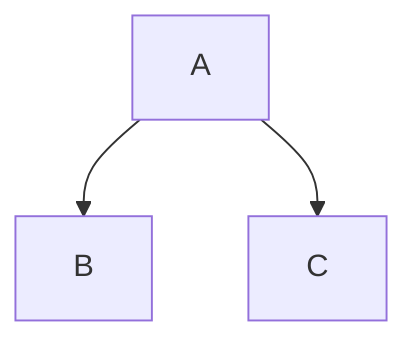

# MkImp

<p align="center">
    
    
    
</p>

**MkImp** lets you write Markdown like a programmer should be able to — with power, precision, and extensibility.

⚠️ **Note:** This is **not** standard Markdown. MkImp defines its own rules and does **not** support arbitrary extensions out of the box.

If you'd like to propose new features, please open an issue or a pull request. If a feature is declined, feel free to fork the project and build on it.

MkImp uses:
- Optionally supports [`Mermaid`](https://mermaid.js.org/) for diagrams (you must handle rendering yourself and no stylesheet are given)

---

## 🚀 Installation

Install using npm:

```bash
npm install mkimp
```

---

## 🔧 Usage

```ts
import { MkImp } from "mkimp";

const mkimp = new MkImp({
  async include(loc, from, to) {
    return `${loc} from [${from}] to [${to}]`;
  },
  async includeCode(loc, from, to) {
    return `${loc} from [${from}] to [${to}]`;
  },
});

console.log(await mkimp.parse("# Hello\n\nThis *is* some __nice__ markdown!"));
```

---

## 🎬 Demo

A demo of MkImp is available here: [MkImp Demo](https://friquetluca.github.io/mkimp_demo/).

---

## ⚙️ Options

```ts
interface MkImpOptions {
  tabulation?: number; // Number of spaces per indentation level (default: 4)
  metadata?: Map<string, string | number | boolean | bigint>; // Front matter metadata (won't override existing entries)
  emojis?: Record<string, EmojiRecord>; // Custom emoji definitions
  frontMatter?: (content: string) => Promise<unknown>; // Custom front matter parser (default: JSON)
  include?: (location: string, from?: number, to?: number) => Promise<string | undefined>; // INCLUDE block handler
  includeCode?: (location: string, from?: number, to?: number) => Promise<string | undefined>; // INCLUDECODE block handler
  withSection?: boolean; // Enable section-based rendering (default: false)
  renderTarget?: RenderTarget; // Output format (default: "raw")
  useLatex?: boolean; // (default: true)
  latex?: (token: TexToken) => Promise<string> // return your own LaTeX transpiler.
  useHLJS?: boolean; // (default: true)
  highlighter?: () => Promise<HighlighterSignature>; // Return your own synthax highlighter.
  overrideRenderer?: Partial<TokenRendering<string>>; // Override the renderer to handle your own token rendering
  articleWrapper?: (content: string) => Promise<string>; // Override the article wrapper
  sectionWrapper?: (content: string, headingId: string | undefined) => Promise<string>; // Override the section wrapper
}

interface LexerOptions {
  tabulation?: number;
  metadata?: Map<string, string | number | boolean | bigint>;
  emojis?: Record<string, EmojiRecord>;
  frontMatter?: (content: string) => Promise<unknown>;
  include?: (
    location: string,
    from: number | undefined,
    to: number | undefined
  ) => Promise<string | undefined>;
  includeCode?: (
    location: string,
    from: number | undefined,
    to: number | undefined
  ) => Promise<string | undefined>;
  includedLocations?: Set<string>;
  tableOfContents?: HeadingToken[];
  abbrs?: AbbrToken[];
  spoilerCount?: number;
  useLatex?: boolean;
}

interface StaticLexerOptions {
  lexer: Lexer;
}

type RenderTarget = "raw" | "article";

type EmojiRecord =
  | { type: "char"; char: string }
  | { type: "img"; url: string; alt?: string; width?: number; height?: number }
  | { type: "i"; className: string };

// Signature of the highlighter you should pass, it's based on highlight.js signature.
interface HighlighterSignature {
  getLanguage: (languageName: string) => unknown | undefined;
  highlight: (content: string, options: { language: string }) => { value: string };
  registerLanguage: (languageName: string, language: (highlighter: any) => any) => void
}
```

---

## 🧱 API

```ts
class MkImp {
  constructor(options?: MkImpOptions);
  ast(markdown: string): Promise<RootToken>;  // Generate AST
  render(root: RootToken): Promise<string>;   // Render HTML from AST
  parse(markdown: string): Promise<string>;   // Directly parse markdown to HTML
}

class Lexer {
  lex(content: string): Promise<MdToken[]>; // Handle the full lexing for the current lexer.
  inlineLex(content: string): MdToken[]; // Handle the inline lexing for the current lexer.
  static async lex(content: string, options?: LexerOptions & Partial<StaticLexerOptions>): Promise<RootToken>; // Create a lexer to handle full lexing
  static inlineLex(content: string, options?: LexerOptions & Partial<StaticLexerOptions>): MdToken[]; // Create a lexer to handle inline lexing
}

/*
  The CSS root definitions for all the variables used in the `defaultStyle` variable.

  The demo used theses root definition alongside it (not included):
  font-family: system-ui, Avenir, Helvetica, Arial, sans-serif;
  font-size: calc(0.8rem + 0.25vw);
  line-height: 1.6;
*/
const rootStyle: string;

/*
  The CSS scrollbar style used in the demo MkImp.

  The demo also used this (not included):
  * {
    scrollbar-color: var(--md-border-color) var(--md-bg-color);
    scrollbar-width: thin;
  }
*/
const scrollbarStyle: string;

/*
The default CSS scrollbar width and color from MkImp demo applied on every single MkImp items that may overflow.
*/
const scrollbarOnAllStyle: string;
/*
  The default CSS style used in MkImp demo.

  The demo also defined the following (not included):
  html,
  body {
    color: var(--md-text-color);
    background-color: var(--md-bg-color);
    height: 100%;
    overflow: hidden;
  }

  But since you may not want to apply the style everywhere, we defined the class `.md-page` that only apply the color and the background color.
*/
const defaultStyle: string;
```

Note: Feel free to create and use your own style instead of the provided one.

---

## 📚 Syntax Guide

MkImp is **not standard Markdown**, so here's a complete overview of supported syntax.

### 🧩 Block Syntax

#### Headings

```md
# Heading 1
## Heading 2
...

Setext-style headings:
Heading 1
===

Heading 2
---
```

Add an ID:  
```md
# My heading {#custom-id}
```

Enable automatic section numbering:
```md
#! Section Heading
```

#### Table of Contents

```md
!TableOfContent
```

#### Abbreviation

```md
*[HTML]: Hyper Text Markup Language
```

#### Code Blocks

##### Indented code:

```
    let x = 42;
```

##### Fenced code:

````
```cpp
const x = 42;
```
````

#### Blockquote

```md
> This is a quote.
```

#### Spoilers

```md
!> Spoiler title
Spoiler content...
<!  // end of spoiler block
```

#### Math (KaTeX)

```latex
$$
a^2 + b^2 = c^2
$$
```

#### Footnotes

```md
[^note]: This is a footnote.

Referenced like so[^note].
```

#### Reference Links

```md
[ref]: https://example.com "Optional title"
```

#### Lists & Task Lists

```md
1. First
2. Second
   - Sublist
   - Item

- [x] Task done
- [ ] Task pending
```

#### Definition Lists

```md
Term
: Definition 1
: Definition 2
```

#### Horizontal Rules

```md
----------------
```

#### Tables

```md
| Key   | Value     |
|-------|-----------|
| One   | First row |
```

#### Raw HTML

You can mix HTML with markdown:

```md
<div>

**Markdown inside HTML block**

</div>
```

#### Small content

```md
-# This is a small content.
```

#### Conditional Rendering

```md
[{ if befalse }]
This sentense is not visible.
[{ else if betrue }]
This sentense may be visible.
[{ if befalse }]
This sentense is not visible either.
[{ endif }]
[{ endif }]
```

#### Includes

```md
!INCLUDE "./file.md"
!INCLUDE "./file.md", l 1:5 s 1  // lines 1–5, shift heading by 1
```

#### Include Code

```md
!INCLUDECODE "./file.ts" (ts), 5:10
```

#### Mermaid Diagrams

````md

```mermaid
graph TD;
    A-->B;
    A-->C;
```
````

Rendering Mermaid is **up to you** — MkImp only passes it through.

---

### ✨ Inline Syntax

| Syntax | Description |
|--------|-------------|
| `\n` | Turns into `<br/>` |
| `{{var}}` | Inject metadata |
| `` `code` `` | Inline code |
| `` | Image |
| `!YOUTUBE[title]{vid="..."}` | Embed YouTube |
| `[label](/url "title")` | Link |
| `[^foot]` | Footnote reference |
| `[text][ref]` | Reference link |
| `$x^2$` | Inline LaTeX |
| `$$x^2$$` | Display LaTeX |
| `<tag>` | Inline HTML |
| `\|\|spoiler\|\|` / `>!spoiler!<` | Inline spoiler |
| `:smile:` | Emoji |
| `==highlight==` | Highlight text |
| `~sub~` | Below |
| `~~strikethrough~~` | Strikethrough |
| `^sup^` | Above |
| `^^overline^^` | Overline |
| `__underline__` | Underline |
| `*italic*` / `_italic_` | Italic |
| `**bold**` | Bold |
| `***bold italic***` | Bold + Italic |
| `___underline italic___` | Underlined italic |

---

## 📦 License

[MIT](./LICENSE)

## 📖 Lisez Moi

Pour les francophones :

[Lisez moi](./LISEZMOI.md)
